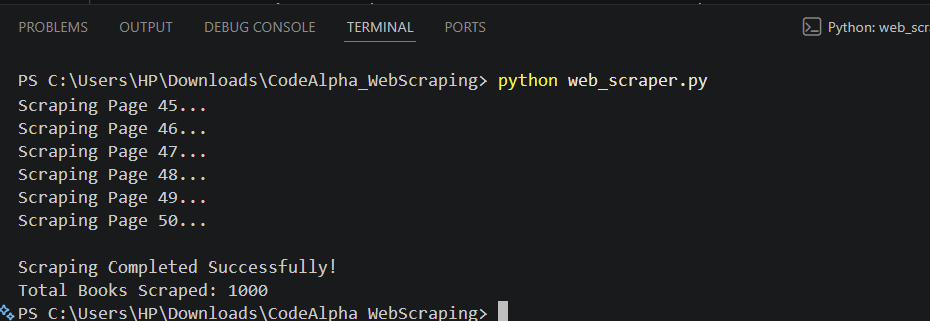
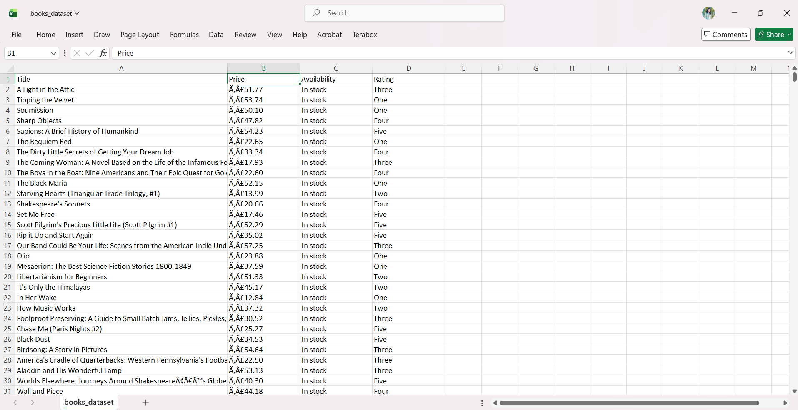
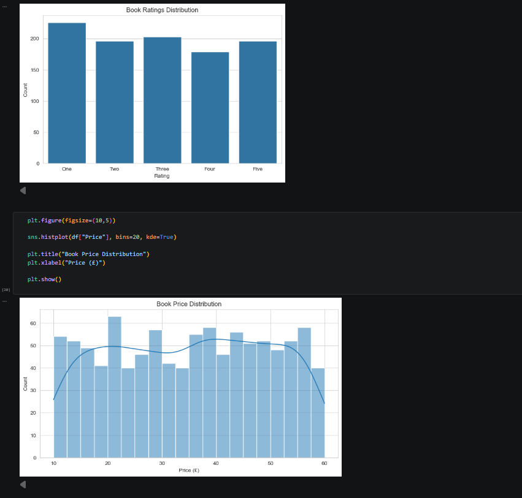
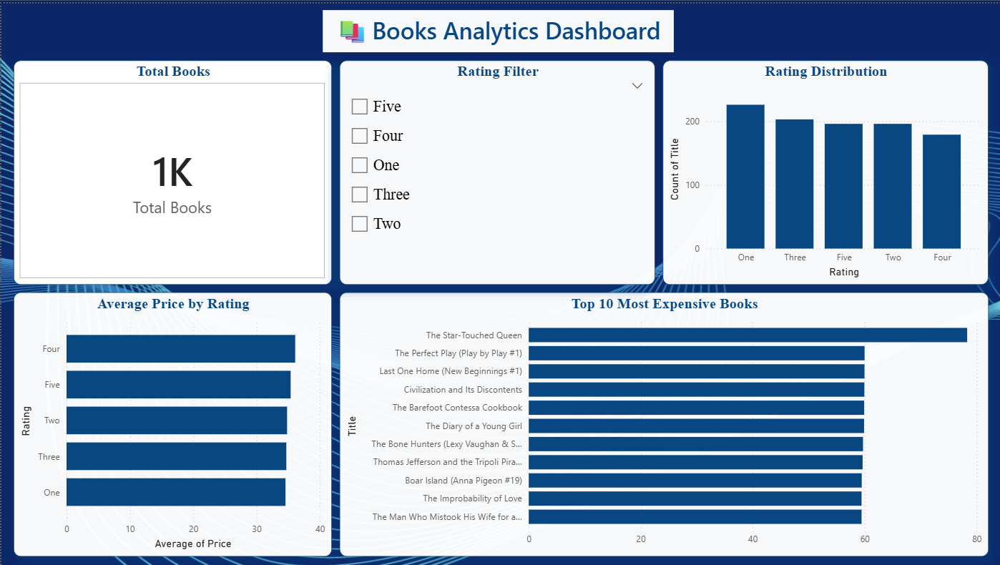

# 📚 Books Analytics Dashboard & Web Scraping

## 📌 Project Overview

This project was developed as part of the CodeAlpha Internship.

It consists of three major tasks:

- Web Scraping using Python
- Exploratory Data Analysis (EDA)
- Interactive Dashboard using Power BI

---

## 🚀 Technologies Used

- Python
- Requests
- BeautifulSoup
- Pandas
- Matplotlib
- Seaborn
- Jupyter Notebook
- Power BI

---

## 📂 Project Files

- web_scraper.py
- books_dataset.csv
- EDA_Books.ipynb
- Books_Dashboard.pbix

---

## 📊 Dashboard Features

- Total Books KPI
- Rating Distribution
- Average Price by Rating
- Top 10 Most Expensive Books
- Interactive Rating Filter

---

## 📈 Dataset

- Source: https://books.toscrape.com/
- Total Books Scraped: 1000

---

## 📸 Project Screenshots

### 1️⃣ Web Scraper Output

---

### 2️⃣ Dataset Preview

---

### 3️⃣ Exploratory Data Analysis

---

### 4️⃣ Power BI Dashboard

---

## 👨‍💻 Author

GS Sindhu
CodeAlpha Internship
